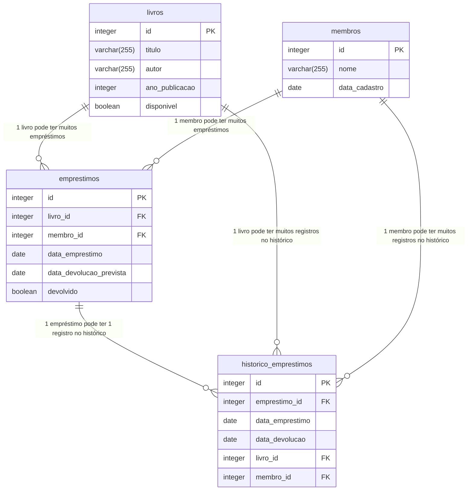

# Pre-requisito

> Link para o repositorio com os códigos: [http://github.com/mrpunkdasilva/learn-jdbc-and-hibernate](http://github.com/mrpunkdasilva/learn-jdbc-and-hibernate)

Para o laboratório, foi escolhido um sistema de biblioteca para a continuidade do projeto.

## Iniciar container


## Modelo Entidade-Relacionamento




## Criação do banco de dados

```sql
CREATE DATABASE BIBLIOTECA;
```


## Criando as tabelas

- **Livros:**

```sql
CREATE TABLE LIVROS (
    ID SERIAL PRIMARY KEY,
    ISBN CHAR(13) UNIQUE NOT NULL,
    TITULO CHARACTER VARYING(100) NOT NULL,
    AUTOR CHARACTER VARYING(100) NOT NULL,
    ANO_PUBLICACAO DATE NOT NULL,
    LIVRO_EM_ESTOQUE BOOLEAN NOT NULL DEFAULT TRUE
);
```


- **Membros:**

```sql
CREATE TABLE MEMBROS (
    ID SERIAL PRIMARY KEY,
    NOME CHARACTER VARYING(120) NOT NULL,
    DATA_CADASTRO DATE NOT NULL
);
```


- **Empréstimos:**

```sql
CREATE TABLE EMPRESTIMOS (
    ID SERIAL PRIMARY KEY,
    ID_LIVRO INTEGER,
    CONSTRAINT FK_LIVRO FOREIGN KEY (ID_LIVRO) REFERENCES LIVROS (ID),
    ID_MEMBRO INTEGER,
    CONSTRAINT FK_MEMBRO FOREIGN KEY (ID_MEMBRO) REFERENCES MEMBROS (ID),
    DATA_EMPRESTIMO DATE DEFAULT CURRENT_DATE,
    DATA_DEVOLUCAO_PREVISTA DATE,
    DEVOLVIDO BOOLEAN DEFAULT FALSE
);
```


- **Histórico de Empréstimos:**
 
```sql
CREATE TABLE HISTORICO_EMPRESTIMOS (
    ID SERIAL PRIMARY KEY,
    DATA_DEVOLUCAO DATE,
    DATA_EMPRESTIMO DATE,

    ID_EMPRESTIMO INTEGER,
    CONSTRAINT FK_EMPRESTIMO FOREIGN KEY (ID_EMPRESTIMO) REFERENCES LIVROS (ID),
    ID_LIVRO INTEGER,
    CONSTRAINT FK_EMPRESTIMO_LIVRO FOREIGN KEY (ID_LIVRO) REFERENCES LIVROS (ID),
    ID_MEMBRO INTEGER,
    CONSTRAINT FK_EMPRESTIMO_MEMBRO FOREIGN KEY (ID_MEMBRO) REFERENCES MEMBROS (ID)
);
```


## Inserindo alguns dados iniciais na tabela

- **Livros:**

```sql
INSERT INTO LIVROS (ISBN, TITULO, AUTOR, ANO_PUBLICACAO, LIVRO_EM_ESTOQUE)
VALUES
('9788535914849', '1984', 'George Orwell', '1949-06-08', TRUE),
('9788535914863', 'A Revolução dos Bichos', 'George Orwell', '1945-08-17', TRUE),
('9788535914870', 'O Senhor dos Anéis', 'J.R.R. Tolkien', '1954-07-29', TRUE),
('9788535914887', 'O Hobbit', 'J.R.R. Tolkien', '1937-09-21', FALSE),
('9788535914894', 'Cem Anos de Solidão', 'Gabriel García Márquez', '1967-05-30', TRUE);
```


- **Membros:**

```sql
INSERT INTO MEMBROS (NOME, DATA_CADASTRO) 
VALUES 
('João Silva', '2023-01-15'),
('Maria Oliveira', '2023-02-20'),
('Carlos Souza', '2023-03-10'),
('Ana Costa', '2023-04-05'),
('Pedro Rocha', '2023-05-12');
```


- **Empréstimos:**

```sql
INSERT INTO EMPRESTIMOS (ID_LIVRO, ID_MEMBRO, DATA_EMPRESTIMO, DATA_DEVOLUCAO_PREVISTA, DEVOLVIDO) 
VALUES 
(1, 1, '2023-10-01', '2023-10-15', TRUE),
(2, 2, '2023-10-02', '2023-10-16', FALSE),
(3, 3, '2023-10-03', '2023-10-17', TRUE),
(4, 4, '2023-10-04', '2023-10-18', FALSE),
(5, 5, '2023-10-05', '2023-10-19', TRUE);
```


- **Histórico de Empréstimos:**
 
```sql
INSERT INTO HISTORICO_EMPRESTIMOS (DATA_DEVOLUCAO, DATA_EMPRESTIMO, ID_EMPRESTIMO, ID_LIVRO, ID_MEMBRO) 
VALUES 
('2023-10-15', '2023-10-01', 1, 1, 1),
('2023-10-16', '2023-10-02', 2, 2, 2),
('2023-10-17', '2023-10-03', 3, 3, 3),
('2023-10-18', '2023-10-04', 4, 4, 4),
('2023-10-19', '2023-10-05', 5, 5, 5);
```


